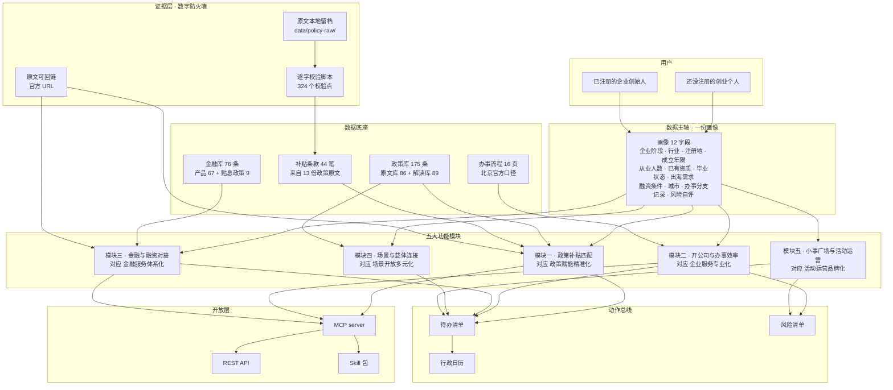
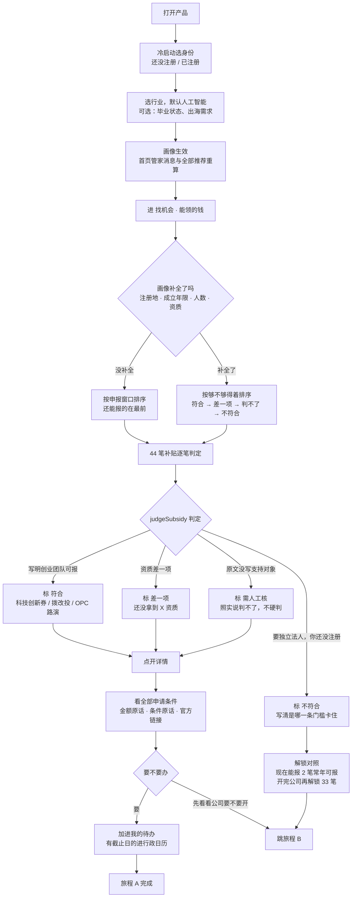
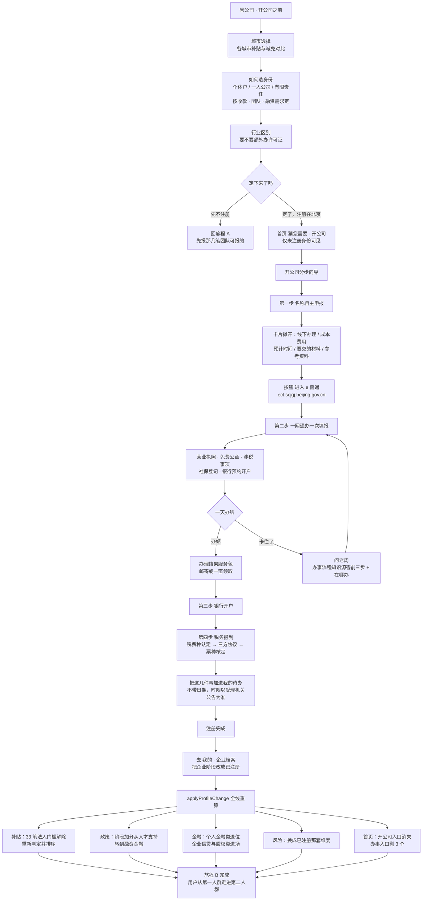
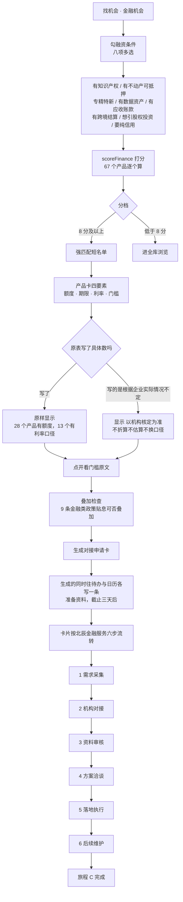
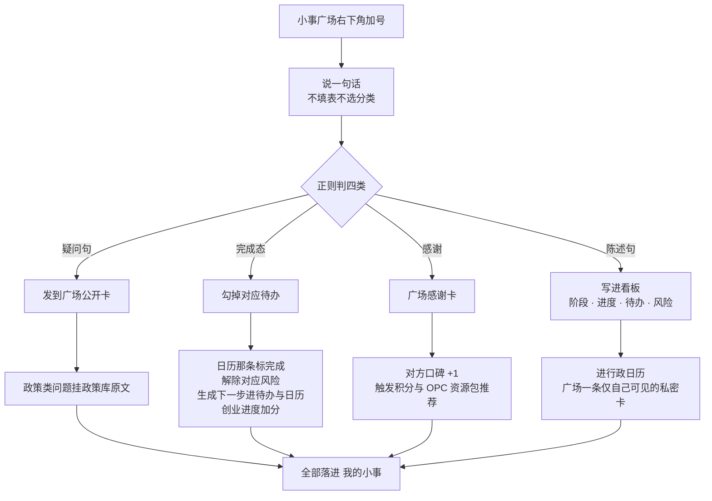
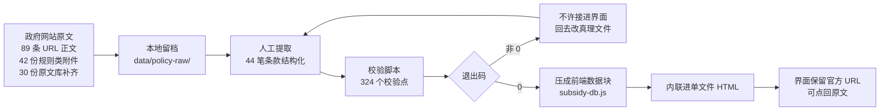

# 创业搭子 · 产品方案文档

本文件由 Claude 生成，属于 shenicest 黑客松「北辰产业云社区」命题的参赛项目「创业搭子」，对应交付物清单里的必交项「产品方案文档」。

- 版本：v1.0，2026-08-29
- 线上原型：https://chuangyedazi.pages.dev
- 原型仓库：`0xmandy/shenicest-beichen-chuangyedazi`（单文件静态 HTML，零外部依赖）
- 开放层仓库：`0xmandy/chuangyedazi-mcp-api`（MCP server 与检索 API）
- 实现细节与复现步骤：`docs/shenicest-北辰命题-创业搭子-需求文档-Claude-2026-08-27.md`（当前 v7，本文档对应它的 4.13 节）

本文档里出现的所有数字，来源分三类，全文统一标注：

| 标注 | 含义 |
|---|---|
| 库内 | 命题方给的政策库、金融工具库原字段，或政府网站政策原文，可回链 |
| 派生 | 由库内数据算出来的统计量，算法在仓库脚本里 |
| 方案 | 本文档提出的设计与假设，尚未实现或尚未与命题方核对 |

---

## 交付项对照

| 交付要求 | 本文档位置 |
|---|---|
| 产品定位与目标用户画像 | 第一节 |
| 核心功能架构图（五大模块如何串联） | 第二节 |
| 至少 3 个核心用户旅程的完整流程图 | 第三节（4 条） |
| 创新点说明（与现有园区服务平台的差异化） | 第四节 |
| 商业模式与运营策略（含 Token / 积分激励设计） | 第五节 |
| 数据安全与隐私合规考量 | 第六节 |
| 可交互原型（至少 3 个场景完整链路） | 线上原型，链路对应第三节三条旅程 |

第七节列已实现与未实现的对照，第八节列待核验缺口。这两节存在的理由是：本产品的核心主张是不生成没有依据的内容，那么方案文档本身也不该把没做的说成做了的。

---

## 一、产品定位与目标用户画像

### 1.1 一句话定位

给还没开公司、但已经有 MVP 或创业意向的个人，配一个把政策补贴和开办流程算清楚的 AI 创业管家。他把自己的情况说一次，管家去 175 条政策、44 笔补贴条款、67 个金融产品、16 类办事流程里逐条比对，告诉他三件事：现在就能报哪几笔、开完公司能解锁哪几笔、开公司这件事今天该做哪一步。

### 1.2 为什么把第一人群定在还没开公司的个人

这个定位来自一个从数据里读出来的事实，也是整个产品的支点。

我们把 13 份政策原文里企业能单独申请的钱结构化成了 44 笔补贴条款（库内），逐笔标了它对申请人的硬门槛。统计结果：

| 门槛 | 笔数 | 占比 |
|---|---|---|
| 明确要求独立法人资格 | 33 | 75% |
| 明确写明创业团队或尚未注册也可申报 | 3 | 7% |
| 原文未写支持对象，需查当年实施细则 | 8 | 18% |

（派生，算法见 `data/policy-subsidy/…结构化….json` 的 `判定门槛` 字段与 `tools/shenicest-tool-补贴条款校验.py`）

那 3 笔写明团队可报的是（库内）：

| 补贴项 | 出处 | 上限 | 窗口 |
|---|---|---|---|
| 科技创新券 | 首都科技条件平台与科技创新券实施办法（2026 年修订版） | 创业团队每年 20 万，单张券 5 万，只付合同金额的一半 | 常年可报 |
| 创赢未来成长计划（拨改投） | 2026 年北京市高精尖产业发展项目资金实施指南（第一批） | 最高 1000 万，形式是拨改投，政府取得对应转股权利 | 常年可报 |
| 创赢未来 OPC 专场路演与创客北京专项赛道 | 支持人工智能 OPC 创新发展行动方案（试行） | 路演档最高 1000 万，赛道档最高 50 万 | 看年度细则 |

对一个还没注册的人来说，这张表回答了两个他自己查不出来的问题：手上这个阶段确实有钱可以拿，但只有很少的几笔；剩下四分之三的钱，注册这一个动作就是钥匙。

于是注册在产品里的含义变了。它从一件迟早要办的行政手续，变成一次可以算清楚的决策：现在报 2 笔常年可报的，还是先花一天把公司开出来，把另外 33 笔的资格拿到手。产品的价值就落在把这道算术摆到人面前。

### 1.3 这个定位与命题方的关系

北京市 2026-06-18 印发的《支持人工智能 OPC 创新发展行动方案（试行）》给出了 OPC 的定义（库内原文）：AI 驱动、小而精的超级经济个体，业务方向为智能体开发、AIGC 产品创制、大模型微调、AI 行业落地应用。方案配套的全栈资源包面向入驻 OPC 成长社区的 OPC 企业，单个企业合计最高 10 万元的模型券、算力券、数据券，社区按季度兑付，每个社区每年最高 1000 万元。

还没开公司但有 MVP 的个人，正是 OPC 的上游。园区拿到一家已成型企业要靠抢，养出一个 OPC 只需要在他还是个人的时候先接上。所以第一人群的选择同时服务两件事：对个人是把创业门槛降下来，对北辰是把招商漏斗往前接一段。

### 1.4 用户画像

**第一人群：还没注册主体的创业个人**（产品第一入口）

三种典型形态：

| 形态 | 特征 | 进来时问的第一句话 | 产品给什么 |
|---|---|---|---|
| 有 MVP 在试水 | 产品能跑，已经在个人收款接单，主体一直没办 | 我这样算不算已经在经营了，要不要开公司 | 能领的钱对照表 + 开公司分步向导 + 个人码大额收款的风险提示 |
| 在校或在职副业 | 项目有雏形，不确定值不值得投入 | 有没有针对学生和早期团队的支持 | 科技创新券等 3 笔团队可报条款 + 在校身份加权匹配 |
| 准备落地北京 | 团队在外地或刚回国，落哪个区没定 | 注册在朝阳跟注册在别的区差多少 | 44 笔按注册地分档（朝阳区 23 / 北京市 12 / 中关村 5 / 经开区 2 / 门头沟区 2，库内） |

共同痛点，按他们自己的说法排序：

1. 不知道有什么钱可以领。政策散在十几个网站，标题看不懂，点进去是通知套通知
2. 不知道自己够不够得着。看到一个补贴，条件写了七八条，逐条对自己的情况得花一下午
3. 不知道开公司这件事有多大。没办过，脑子里是一个模糊的大工程，于是一直拖
4. 不知道拖着有什么代价。个人收款、没有合同主体、软著挂个人名下，这些风险没人提醒

**第二人群：已注册的中小微企业创始人**（并列人群，同一账号延续）

园区内 AI、机器人、数据服务类团队，5 到 50 人，没有专职政务专员，没有 CFO。痛点是政策追不动、融资对接繁、合规事项漏办。

两个人群的关系是同一条时间线的前后段，不是两个产品。企业阶段是画像里的一个字段，用户在「我的」页随时可改，改完当场重算：政策的阶段加分、补贴的门槛判定、金融产品的适用性、风险页的维度、首页办事入口里出不出现开公司，六处一起变（已实现，`applyProfileChange()`）。注册那天用户把这个字段一改，产品自己就从第一段走到第二段，档案、待办、日历、小事记录全部延续。

### 1.5 形态与边界

Web 端，手机壳尺寸 393x852 展示，与北辰现有小程序生态一致，可平移为微信小程序。

服务范围固定在北京。城市字段不开放，理由是政策库只有北京口径，放开城市会算出一堆用不上的结果。

产品不做的事，写在这里免得被误解：不代办注册，不代申报，不对申报结果做成功率预测，不给融资建议，不出企业评级。产品做的是把原文摆到人面前并且算清他够不够得着。

---

## 二、核心功能架构（五大模块如何串联）

### 2.1 架构总图

### 2.2 五大模块各自做什么

| 模块 | 命题方向 | 吃哪份数据 | 输出 | 状态 |
|---|---|---|---|---|
| 一 · 政策补贴匹配 | 政策赋能精准化 | 政策库 175 条 + 补贴条款 44 笔 | 匹配报告（逐条回显加分理由）、能领的钱（金额与条件带原话）、够不够得着判定 | 已实现 |
| 二 · 开公司与办事效率 | 企业服务专业化 | 16 页办事流程，北京官方口径 | 开公司之前三节点（选城市 / 选身份 / 行业区别）、开公司分步向导、每步的材料成本时间、官方入口链接、加进待办 | 已实现 |
| 三 · 金融与融资对接 | 金融服务体系化 | 金融库 67 产品 + 9 条贴息政策 | 适配短名单（四要素原文）、对接申请卡按北辰 SOP 六步流转 | 已实现 |
| 四 · 场景与载体连接 | 场景开放多元化 | 政策库园区载体条目 + 北辰四大园区名单 | 入驻园区页、OPC 成长社区入口 | 部分实现 |
| 五 · 小事广场与活动运营 | 活动运营品牌化 | 用户生成内容 + 园区活动 | 一句话记小事四路由、广场问答、口碑与积分 | 部分实现 |

### 2.3 五大模块靠什么串起来

一个门户把五个功能摆在五个菜单里，用户还是得自己知道要点哪个。这个产品把它们串起来靠三件东西。

**第一根：数据主轴，一份画像。**

画像是 12 个字段，全部是枚举值。用户在冷启动填 3 个，其余在用的过程中随手补。每个字段都有明确的下游用途，没有用途的字段不收：

| 字段 | 被谁吃 | 吃它判什么 |
|---|---|---|
| 企业阶段 | 模块一二三四五 | 补贴的法人门槛、政策的阶段加分、金融产品的适用性、开公司入口的显隐、风险页用哪套维度 |
| 行业 | 模块一三 | 政策主标签加 6 分、相关标签各加 2 分；数据要素与三个科技行业影响金融打分 |
| 注册地 | 模块一 | 补贴条款的属地门槛（朝阳区 / 经开区 / 门头沟区 / 北京其他区） |
| 成立年限 | 模块一 | 补贴条款的成立年限上限 |
| 从业人数 | 模块一 | 补贴条款的人数上限，例如科技创新券的 500 人 |
| 已有资质 | 模块一 | 补贴条款的资质门槛，差一项会标成差一项而不是不符合 |
| 毕业状态 | 模块一 | 在校生给青年人才与大学生创业类条目加权 |
| 出海需求 | 模块一三 | 企业出海类政策与跨境类金融产品加权 |
| 融资条件 | 模块三 | 八项多选，每命中一项加 4 分 |
| 城市 | 全局 | 固定北京，不开放 |
| 办事分支记录 | 模块二 | 记住开公司走到哪步、社保属于哪种情况 |
| 风险自评 | 模块二 | 风险清单的自评结果 |

一处改动，全线重算。这是和五个功能拼一个门户的根本差别。

**第二根：动作总线，待办与日历。**

五个模块的输出终点是同一个地方。政策匹配到一笔能报的补贴，加进待办；开公司向导走到银行开户，加进待办；金融对接卡进入下一步，加进待办；小事广场说一句我把执照办下来了，勾掉对应待办、解除对应风险、生成下一步。待办带日期的进行政日历。

用户不需要知道一件事来自哪个模块，他只需要看今天要办什么。

**第三根：证据层，数字防火墙。**

所有会影响用户决策的数字，走同一条链路：政府网站原文抓取并本地留档，结构化成真理文件，校验脚本逐字比对，退出码为 0 才允许接进界面，界面上保留官方 URL 可点回。这条链路是四条防幻觉纪律的工程形态，第四节展开。

**加一层：开放层。**

三份知识与两张打分表已经做成 MCP server 与 REST API，任何支持 MCP 或 Skill 的 AI 工具装一次就能查。这一层的意义是生态连接的实际形态：园区的知识不只活在园区自己的 App 里，它可以进到创业者已经在用的任何一个 AI 工具里。对账脚本保证 API 的匹配结果与网页逐条一致，避免同一个问题在两个地方得到两套答案。

---

## 三、核心用户旅程

四条旅程，前三条是必走通的主链路，第四条是留存机制。

### 3.1 旅程 A：从不知道能领什么，到今天能报哪一笔

主角是还没注册的个人。这条旅程回答第一节 1.4 里的痛点 1 和 2。

这条链路上的三处设计，都是为第一人群专门做的：

1. 不符合的条款不隐藏。判定结果写清是哪一条门槛卡住（这条要有公司主体，你还没注册），而不是简单地从列表里过滤掉。用户需要看见那 33 笔，才知道注册这个动作值多少钱
2. 判不了的照实说判不了。8 笔原文没写支持对象的，界面标需人工核，并把原文那句摆出来，不替它猜一个门槛
3. 原文没写申报截止日的 30 笔，显示看年度细则，不替它编一个日期

### 3.2 旅程 B：从没开过公司，到执照下来，到补贴重算

这条旅程回答痛点 3 和 4，是新定位下最核心的一条。

这条旅程的设计要点：

- 分步向导的颗粒度做到小动作一级。每一个小动作卡片按需挂线下办理、成本费用、预计时间、要交的材料、参考资料。没办过的人怕的是不知道下一步是什么，颗粒度不够就等于没解决
- 流程里的每个数字都来自检索到的北京官方口径，出处记在脚本注释里。全文唯一的外链是 e 窗通，域名与市监局开办企业一网通办同源，核实过程记录在需求文档 4.10
- 注册完成不是终点，是画像上的一次字段变更。产品在这一刻把用户从第一人群交接到第二人群，档案与历史全部延续

### 3.3 旅程 C：注册之后第一次找钱

六步的名称来自命题 PPT 里的北辰金融服务流程（需求采集 / 机构对接 / 资料审核 / 方案洽谈 / 落地执行 / 后续维护），产品照搬，不另起一套自己的说法。

这条旅程的设计要点：额度与利率只能来自命题方那张表。67 个产品里 28 个写了具体额度、13 个写了利率口径，其余照实显示为以机构核定为准。把六成产品的额度装成有数据，路演现场被追问一句这个数哪来的，整套说法就塌了。照实显示反而是这个产品最硬的部分。

### 3.4 旅程 D：一句话记一件小事（留存机制）

前三条解决从不知道到办成，这条解决办完之后还回不回来。

判定规则摆在界面上给用户看，不做黑盒。这一条对第一人群尤其重要：还没注册的人手上没有报表没有台账，唯一能沉淀的就是他嘴里说出来的进展。

---

## 四、创新点：与现有园区服务平台的差异化

### 4.1 五条差异

| 维度 | 服务目录型平台 | 创业搭子 |
|---|---|---|
| 交互起点 | 用户先知道自己要办什么，再去找入口 | 用户交一份画像，产品去逐条比对后把结论推过来 |
| 政策呈现 | 政策列表加全文，看不看得懂是用户的事 | 44 笔补贴拆到条款级，金额条件逐字来自原文，并判定用户够不够得着 |
| 面对不确定 | 要么不写，要么写一个模糊的说法 | 判不了的显式标出来并摆出原文那句，30 笔没写截止日的显示看年度细则 |
| 未注册用户 | 通常不是服务对象，或只有一个注册指引页 | 第一入口人群，注册被做成一次可算的收益决策 |
| 知识的活动范围 | 只活在平台自己的 App 里 | MCP server 与 API，园区知识可进任何 AI 工具 |

北辰现有小程序的具体功能清单未逐项核对，上表左列写的是服务目录型产品的共性，不是对某一个具体产品的评价。这一条列在第八节待核验缺口里。

### 4.2 创新点一：把注册做成一次收益测算

这是新定位下最独有的一条，其他园区平台没有做的理由是他们的用户从注册之后才开始。

产品在补贴栏上给的对照是：你现在能报 2 笔常年可报的（科技创新券、创赢未来拨改投），第 3 笔看年度细则；开完公司，另外 33 笔的法人门槛解除，重新判定。

这个对照能成立的前提是补贴条款被拆到了门槛字段级。`judgeSubsidy` 只用四个画像字段判原文写死的硬门槛，判不了的部分写进 `beyond` 照实说，不硬判：

| 判定结果 | 触发条件 | 界面表现 |
|---|---|---|
| 符合 | 所有能判的门槛都过 | 排在最前 |
| 差一项 | 资质类门槛差一项 | 标还没拿到 X，给出补齐路径 |
| 不符合 | 法人 / 属地 / 人数 / 年限任一条明确不满足 | 标不符合并写清是哪一条卡住，不隐藏 |
| 判不了 | 原文没写支持对象 | 标需人工核，摆出原文那句 |

### 4.3 创新点二：数字防火墙，把防幻觉做成可执行的工程

命题 PPT 用整页讲三层知识库根除 AI 幻觉。我们把它做成了四条纪律加一条流水线。

四条纪律：

1. 政策与金融的额度、期限、利率只能来自原文，不折算、不估算、不换口径
2. 办事流程里的数字必须来自检索到的官方口径，出处记在脚本注释里，不许凭记忆写
3. 检索不到就说检索不到，判定不了的显式标需人工核，不吞掉
4. 界面上不写元描述。产品是给创业者用的，不给评委看数据边界说明

流水线：

校验脚本查三类东西：金额原话与条件原话必须逐字出现在本地留存的原文里；金额范围里每个数字和百分比必须能在原文找到；金额排序值按口径规则查。

这里有一个踩过四次的坑，值得单说：卡面上那句最多能拿，不许直接摆原文里的额度句。首贷贴息原文的 2000 万是贷款合同上限，企业培育奖励的 1 亿是营收门槛，OPC 资源包的 1000 万是社区一年的兑付上限，三个都不是企业能拿到手的钱。所以真理文件里另开了手工写的卡面金额字段，口径是一家企业按这一条最多能拿多少，由校验脚本盯住两者不许对不上，并且明令不许用正则批量覆盖。防幻觉的难点不在模型会不会编，在于原文里的数字本身就有多种含义。

### 4.4 创新点三：一句话小事引擎

创业者不填表。产品把输入降到一句话，正则判四类，各自落到不同的地方，判定规则摆在界面上。这套引擎让待办、日历、风险、进度四个东西有了一个统一的、零成本的入口。

### 4.5 创新点四：知识的开放层

三份知识与两张打分表做成了 MCP server、REST API 和 Skill 包。一句话安装，AI 工具读完说明自己判断走哪条路。对账脚本把原型 HTML 里的打分函数抠出来在 Node 里跑一遍，和服务端的输出逐条比 id 与分数，保证两边不分叉。

对园区的意义：企业服务不必等用户想起来打开某个 App。用户在自己的 AI 工具里问一句北京有什么补贴能领，园区的知识就在答案里。

---

## 五、商业模式与运营策略

本节全部标注为方案，尚未与命题方核对，数字为设计口径不是承诺。

### 5.1 谁付钱

主收入来自用户本人，一份 99 元一年的个人会员，加上按件计费的专项底稿。园区与金融机构是另外两条线。产品不收服务商的钱。

| 付费方 | 买什么 | 计费 | 红线 |
|---|---|---|---|
| 个人与微小企业（主）| 会员：办事细则层全开，含办理地点、材料清单、时限、咨询电话、专项许可底稿 | 99 元 / 年 | 不代办、不代申报、不承诺审批结果 |
| 个人与微小企业（主）| 按件：单张许可证的办理底稿、单笔补贴的申报陪跑 | 按次，三档 29 / 99 / 199 元（方案，未验证） | 同上；查不到就退款，不拿一份含糊的东西交差 |
| 园区（次）| 招商漏斗前端与企服人力替代 | 年度订阅，锚点是覆盖个人数、建档数、注册转化数、办结事项数 | 不按招商成交额抽成 |
| 金融机构（次）| 对接线索与产品上架位 | 按有效对接次数计信息服务费 | 不按放款金额抽成，避免变成助贷；排序由打分表决定，不出售 |

**为什么把主收入放在用户这边。** 向服务商收钱是这类产品最顺手的路：工商财税代理、知产代理、法律顾问都愿意为对接位付费。这条路的代价是排序迟早会被买走，产品从帮用户挑变成帮出价最高的那家找客户，而用户看不出这一层什么时候发生的。收用户的 99 元，产品和小企业主的利益就是同一个方向：他省下的时间和拿到的钱，就是他续费的理由。所以服务商这条线从收入表里去掉。

**免费的部分与付费的部分怎么分。** 免费层是信任的入口，也是园区漏斗要的东西，不设闸：175 条政策匹配、44 笔补贴的金额与条件、够不够得着的四态判定、每一条的官方原文回链、16 类办事流程的主干步骤。用户先验证这个产品说的是不是真的，再决定要不要付钱。付费层是办事细则，也就是他真要动手那一刻缺的那一层。

**收费点在通用 AI 给不出的那一层。** 这不是一句愿望，repo 里已经有两份跑出来的底稿可以当样本。

第一份是第二类增值电信业务经营许可（`data/task-license/…facts-二类增值电信业务经营许可证办理….md`，202 行，检索日 2026-08-29）。一家 AI 公司开始对外收费就会撞上它。通用 AI 回答这个问题时给的是一段笼统的科普，或者更糟，把广东省通信管理局申请指南里那条「最近一个月为三个负责人缴纳社保」当成全国口径讲出来。这份底稿给的是：

- 注册资本门槛 100 万元（省内经营）或 1000 万元（跨省），出处是工信部令第 42 号第六条
- 办 EDI 证还是 ICP 证的判据，取自《电信业务分类目录（2015 年版）》原文：卖 API 调用量与数据处理落 B21，做对话式产品与内容平台落 B25，撮合交易落 B21
- 北京市通信管理局，西城区马连道路 4 号，咨询电话 (010)51938038，网办入口 `ythzxfw.miit.gov.cn`，现场办理 0 次，不收费
- 法定 60 自然日审查完毕，北京承诺 40 个工作日；有效期 5 年；每年第一季度报年报，不报进电信业务经营不良名单
- 「3 个人 1 个月社保」那条的三点澄清：原文写的是三个负责人不是三个员工、出处是广东省通信管理局、北京市通信管理局没有公开发布这一层，所以产品里不把广东的口径写成北京的

最后那一条才是这份底稿真正值钱的地方。它给的不只是答案，还有答案的边界：哪一句有出处、出处在哪一级、哪一句在北京查不到。九条待核验缺口逐条列在文件第七节。

第二份是补贴办理细则（`data/policy-subsidy/…补贴办理细则与办理地点….md`）。44 笔补贴的真理文件有 20 个字段，写清了能拿多少、够不够格、什么时候，但没有一个字段是办理地点、申报入口、材料清单、咨询电话。原因在体裁：《XX 若干措施》这类纲领文件只定钱和条件，办事那部分住在每年另发的年度征集通知里，更细的报送地址还要再往下一层住在通知附件的《实施方案》里。把那两层抓回来之后，44 条里 26 条有了办理线索，18 条本地正文里一个办事字都没有，照实标出来。

这两份底稿是同一套方法产出的：抓原文、留本地档、逐字校验、查不到就说查不到。会员买的是这套方法持续跑出来的结果。

**99 元这个数怎么定的。** 对照物是用户自己去查这些东西要花的时间，以及他能拿到的钱。库内那 44 笔里最小的一笔也是万元级，科技创新券对创业团队一年最多 20 万。一年 99 元是其中的万分之几，用户不需要算就知道划不划算，这个价位不构成决策成本。定价没有做过用户验证，列在第八节缺口里。

**成本结构。** 静态托管加边缘函数，单用户边际成本接近零。真实成本在数据维护，也就是政策原文与办事口径的持续抓取、结构化与校验。这部分是产品护城河，也是唯一需要持续投人的地方，会员费直接对着它。

### 5.2 对北辰的价值口径

招商漏斗五级，每一级都可计数：

现有招商的做法是在第四级抢已成型的企业。产品把接触点提前到第一级，在个人还没注册的时候先接上，注册地址与孵化载体在旅程 B 里自然导入北辰。

### 5.3 积分与 Token 设计

这一节分两层，先把哪层是政策既有、哪层是产品自建说清楚。

**第一层：OPC 资源券，政策既有，产品只做入口与台账。**

北京市《支持人工智能 OPC 创新发展行动方案（试行）》里的全栈资源包（库内原文）：入驻 OPC 成长社区的企业可免费享受 3 个月的模型使用、智能算力使用、数据代采赠送等服务，单个企业合计最高不超过 10 万元；由 OPC 成长社区按季度申请兑付，每个社区每年最高不超过 1000 万元。券的形式是模型券（Token 券）、算力券、数据券。

产品在这一层做三件事，一件都不多做：

1. 入口：判定用户是否够得着（要入驻 OPC 成长社区、要是 OPC 企业），够不着的说清差在哪
2. 台账：记录申请状态与季度兑付进度，10 万元额度用了多少还剩多少
3. 提醒：季度兑付节点进行政日历

产品不自己发券，不代兑付，不对额度做承诺。券的发放方是社区，产品是台账。

**第二层：创业分，产品自建的积分体系。**

设计目的是让产品在用户没有待办的日子里也有人回来，同时让广场上的互助沉淀下来。

获取规则（方案）：

| 行为 | 分值 | 设计意图 |
|---|---|---|
| 记一件小事 | 2 | 最低成本的日活行为 |
| 完成一条待办并回填结果 | 5 | 把分数绑在真实进展上 |
| 在广场回答别人的问题并被采纳 | 10 | 互助的主要产能 |
| 收到一次感谢 | 5 | 由被感谢方产生，本人刷不出来 |
| 完成注册（企业阶段变更并回填执照编号） | 30 | 与园区目标一致的最高权重 |
| 申报成功并回填批复凭据 | 50 | 闭环回填，同时给产品攒上申报成功率的真实样本 |

消耗规则（方案）：

| 权益 | 分值 | 兑现方 |
|---|---|---|
| OPC 专场路演推荐位排序 | 200 | OPC 成长社区 |
| 园区活动优先报名（年度 67 场） | 50 | 北辰运营 |
| 企服顾问一对一时长 | 150 | 园区企服中心 |
| 申报材料预审一次 | 300 | 园区企服中心 |

三条合规红线，写在设计里：

1. 不发行代币，不上链，不做二级流转，不可转让不可提现不可兑换法币。创业分是排序权重，不是资产
2. 权益的最终发放方是园区与社区，产品只做排序与台账。产品不承诺任何一项权益一定拿得到
3. 高权重行为一律要求回填凭据（执照编号、批复凭据），凭据由人工或接口核验后计分，避免刷分

反作弊：口碑分只能由被感谢方产生；同一用户对同一对象的感谢每周计一次；回答被采纳由提问者确认；注册与申报类分数需凭据核验。

**待核验：** OPC 积分体系是否已有官方口径尚未拿到。目前产品里只在感谢功能出现了 OPC Token 字样，属于演示级。上表全部标方案，落地前必须与北辰和 OPC 成长社区对齐，对不上就整段撤掉，不带着一个自造的积分体系上线。

### 5.4 运营策略三阶段

**第一阶段，冷启动（0 到 3 个月）：把第一批人找到。**

第一人群不在园区里，得去他们在的地方接。三个入口：OPC 成长社区的入驻与路演环节；高校创业中心与在校创业团队（科技创新券明确支持在校学生的创业团队，是天然的抓手）；园区年度 67 场活动与两场大赛的扫码入口。

种子内容已经就位：44 笔补贴条款、16 页办事流程、67 个金融产品。冷启动不需要用户生成内容也能用。

**第二阶段，留存（3 到 12 个月）：靠日历和提醒。**

创业早期的节奏是几周才有一件事。产品的留存点是行政日历与到期提醒，用户不必主动想起来。小事广场提供同伴内容，解决日历空窗期。

**第三阶段，转化（持续）：把注册这一步做顺。**

转化的定义是企业阶段字段从未注册变成已注册，并且注册地落在北辰四大园区。旅程 B 就是转化漏斗本身。转化后用户进入第二人群，产品的服务密度上升（金融对接、风险体检、报税社保），留存自然提高。

付费转化挂在同一条线上，触发点是用户第一次真要动手办某件事：他在办事流程页走到需要办理地点、材料清单、咨询电话那一步，或者在补贴卡上点了申报。这时候摆出来的是那件事的完整底稿，不是一个泛泛的会员页。先让他看清楚缺的是哪一层，再谈 99 元。付费与注册两件事互不为前提，没付费的照样能走完注册，园区漏斗不受影响。

**运营方管理端（未实现，方案）：** 画像台账、注册转化漏斗、申报漏斗统计、待跟进名单。这部分目前只在文档层，是落地时的第一优先补齐项。

---

## 六、数据安全与隐私合规

### 6.1 三类数据分级

| 类别 | 具体内容 | 敏感度 | 存在哪 | 谁能看 |
|---|---|---|---|---|
| 公共知识 | 政策库 175 条、补贴条款 44 笔、办事流程 16 页 | 公开 | 内联在静态 HTML 里 | 所有人 |
| 半公开知识 | 金融库 76 条，含 8 家机构的门槛与利率口径 | 园区内部统计 | 内联在静态 HTML 里 | 见 6.5，需处置 |
| 用户数据 | 画像 12 字段、待办、日历、小事记录 | 个人信息 | 见 6.2 | 仅用户本人 |

### 6.2 存储边界

**端上优先。** 画像与全部用户生成内容存在浏览器 localStorage，不上传也能完整使用产品。这是对第一人群最重要的一条：一个还没注册的人，凭什么把自己的创业想法交给一个刚认识的平台。

**服务端只存枚举值。** 开放层的 Worker KV 里只存两样东西：

- 画像六个字段（company / industry / graduation / overseas / finCond / biz），全是枚举值，组合起来指不到任何一家具体的公司或任何一个具体的人。写入走 `normalizeProfile()` 过滤，调用方多塞的字段进不来
- 用量计数，key 是哈希后的标识加日期

**明确不收集的清单。** 这一条对第一人群格外重要，因为一个还没有公司的人，手上能被要走的就只有个人身份信息：

| 不收集 | 理由 |
|---|---|
| 姓名、手机号、身份证号 | 产品的全部判定都不需要 |
| 学历、学籍、社保记录 | 毕业状态只收在校 / 已毕业两个枚举值，够判青年人才类条款 |
| 银行流水、收款记录 | 金融匹配靠八项融资条件的自述，不需要凭据 |
| 企业名称、统一社会信用代码、联系人 | 服务端不存；执照编号仅在积分回填场景由用户主动提交，且核验后不留存原件 |
| 聊天原文 | 管家问答在端上完成检索，问句不上报 |
| 通讯录、位置、相册 | 不申请对应权限 |

**最小必要的自证方式。** 第二节 2.3 那张字段表就是自证：每一个收集的字段都能指出它被哪个模块吃、判哪一条门槛。指不出用途的字段不收，这是收集字段时的准入规则。

### 6.3 跨境与出境

开放层部署在 Cloudflare 的边缘节点，属于境外基础设施。这件事之所以现在成立，靠的是 6.2 那条边界：KV 里没有可识别到具体自然人或具体企业的信息，六个枚举字段的组合不构成个人信息，因此不涉及个人信息出境。

这条边界一旦破了，整件事的合规判断要重做。所以定下一条规则：如果未来要收集任何可识别信息（手机号、企业名称、执照编号的留存），服务端必须先迁到境内节点，再谈功能。功能让位于这条边界，不反过来。

静态原型托管在 Cloudflare Pages，同理。政策与金融数据本身是公开或半公开知识，不涉及个人信息。

### 6.4 与生成式 AI 相关的合规

当前版本的管家问答是端上检索加模板拼装，没有调用任何大模型，因此不落入《生成式人工智能服务管理暂行办法》的适用范围。

接入模型之后必须同步做三件事，写在这里作为落地前置条件：

1. 具有舆论属性或社会动员能力的服务，按办法要求经属地网信部门备案
2. 已上线应用须在显著位置公示所用已备案模型的名称与备案号
3. 生成内容的标识按内容标识办法执行

产品自己的办事流程页里就有一页讲大模型备案（算法备案 / 生成式服务备案 / 语料与版权 / 内容标识），这些要求对自己同样适用。

### 6.5 金融库的敏感度与处置

金融库那 76 条是园区内部统计，含 8 家机构的适用门槛与利率口径。这份数据目前已经随 Pages 公网发布、可被搜索引擎抓取。

三个处置选项，落地前必须由命题方选一个：

| 选项 | 做法 | 代价 |
|---|---|---|
| 保持公开 | 不动 | 机构口径对外可见 |
| 加访问闸门 | 给 Pages 项目加 Cloudflare Access，或做园区账号登录 | 失去一句话即可访问的体验，开放层的 API 需要同步加鉴权 |
| 脱敏发布 | 公开版只留产品名与机构，门槛与利率口径需登录后可见 | 匹配结果的说服力下降 |

开放层目前没有设 token 闸门，理由是数据已经公网可见，单一共享 token 挡不住已经公开的东西，还会挡住自己的 Skill 用户。防批量抓取由每日匿名限额承担。真要做限制，做的是每人一个 key 的发放体系，那时候重做而不是复用。

### 6.6 不出结论就是一种风险控制

产品不出企业评级、不出申报成功率、不预测能批多少钱、不给融资建议。这条纪律最初是为了防幻觉，它同时是合规设计：

- 不做成功率预测，就不构成对行政审批结果的承诺
- 不做融资建议与产品推荐排序的商业化，就不构成投资顾问或助贷
- 判定引用原文并可点回官方链接，用户的决策依据是政府文件本身，产品的角色是检索与比对

风险页的脚注按这条改写过：说明的是倾向，不是合规结论，拿不准找企服中心或专业顾问。

### 6.7 运营端与留痕（未实现，方案）

管理端落地时需要的三条：

1. 角色分权。招商、企服、金融对接三类角色看到的字段范围不同，画像明细仅在用户授权后对企服角色可见
2. 操作留痕。任何一次对用户档案的查看与导出留日志
3. 数据下线机制。政策失效或数据源变更时，对应条款在界面上标失效而不是静默删除，用户已加进待办的条目要收到变更提醒

---

## 七、已实现与未实现

诚实分档，路演时按这张表回答，不含糊。

**已实现并可现场演示：**

- 冷启动建画像，两类身份切换，画像 12 字段随时可改，改后六处连带重算
- 政策匹配：175 条逐条打分，加分理由回显，高匹配 / 相关 / 全库检索三档
- 能领的钱：44 笔补贴条款，金额与条件带原话，四态判定，三种排序，详情可点回官方原文
- 开公司分步向导：小动作级颗粒度，材料成本时间，e 窗通真实入口
- 16 页办事流程，北京官方口径，含开公司之前的三节点（选城市 / 选身份 / 行业区别）
- 金融匹配：67 产品打分，四要素原文，9 条贴息政策，对接卡按北辰 SOP 六步
- 风险体检：按已注册 / 未注册分两套维度
- 小事引擎四路由，真写入待办与日历
- 管家老周三个知识源问答（办事流程 / 金融 / 政策），25 条测试问法逐条验过路由
- MCP server、REST API、Skill 包，与原型打分逐条对账一致
- 三条自查流水线：语法检查、22 个状态的截图与横向溢出探针、45 条档案连带重算与判定口径断言

**未实现：**

- OPC 积分体系没有真实口径，产品里只在感谢功能出现 Token 字样
- 运营方管理端（画像台账、转化漏斗、申报漏斗统计）只在文档层
- 场景开放的具体对接机制没做
- 创业进度条在数据层跑，界面上没有落脚点
- 上架 App、上架小程序、做自媒体、写合同、开发票五页是通用办事顺序，命题方两个库覆盖不到
- 开单诊断、云服务规划、找顾问三个服务页是通用文案，无数据支撑
- 会员与按次的支付链路没做。第五节 5.1 讲的免费层与付费层，界面上现在全部开放，没有闸门也没有收银台
- 5.1 举的两份付费层样本已经成文并逐条留了本地原文，但界面入口还没接：第二类增值电信业务经营许可底稿（`data/task-license/…`）在办事流程里没有对应页，补贴办理细则（`data/policy-subsidy/…`）没有接进补贴详情页

## 八、待核验缺口

1. 北辰现有小程序的功能清单未逐项核对。第四节 4.1 左列写的是服务目录型产品的共性，不是对具体产品的评价
2. OPC 积分与资源包的现行操作口径未拿到，第五节 5.3 全部标方案
3. 175 条政策未逐条核对时效，可能混有已过期条目
4. 44 笔补贴条款按 2026-08-29 计：8 笔还能报（3 笔有明确截止日未过、5 笔常年可报），6 笔今年批次已过，30 笔原文没写批次显示看年度细则。这个结论会随时间变化，需要定期重跑
5. 金融库约六成产品的额度或利率写根据企业实际情况不定，匹配只能到门槛过筛的粒度
6. 金融库的公开范围需命题方在 6.5 三个选项里选一个
7. 商业模式一节的付费方与计费锚点未与北辰核对，全部是设计口径。会员 99 元一年与按件三档 29 / 99 / 199 元没有做过任何用户验证，也没有验证过免费层与付费层的切分点选得对不对
8. 第二类增值电信业务经营许可那份底稿自带九条待核验缺口（北京口径的材料细则检索不到、三个负责人指谁没有定义、注册资本认缴还是实缴未写、40 工作日与 60 自然日的关系未查清等），逐条列在该文件第七节。它作为付费层样本被引用，落地前这九条要先收口
9. 补贴条款的办理细则与办理地点已单独整理（`data/policy-subsidy/…补贴办理细则与办理地点….md`），44 条里 26 条抓到办理线索、18 条本地正文一个办事字都没有，且未与各受理部门官网逐条复核
