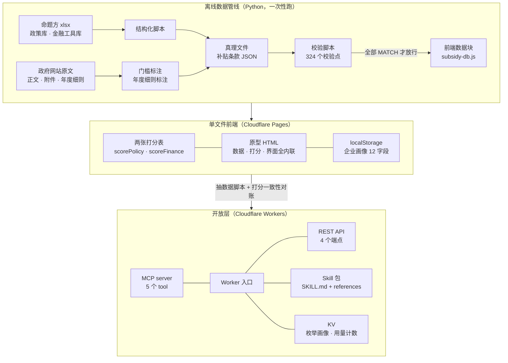
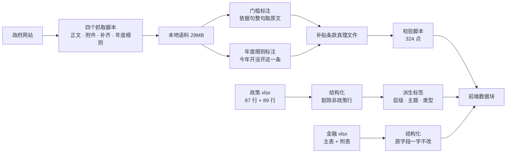

# 创业搭子 · 技术方案与开发过程

本文件属于 She Nicest Hackathon 2026「北辰产业云社区」命题的参赛项目「创业搭子」，与产品方案文档配套：那一份讲产品做成什么样，这一份讲它是怎么搭起来、怎么保证不出错的。

- 版本：v1.0，2026-08-30
- 线上原型：https://chuangyedazi.pages.dev
- 开放层：https://chuangyedazi-api.safepanda.workers.dev/
- 原型仓库：`0xmandy/shenicest-beichen-chuangyedazi`
- 开放层仓库：`0xmandy/chuangyedazi-mcp-api`

---

## 一、技术概览

| 项 | 现状 |
|---|---|
| 前端形态 | 单文件静态 HTML，720KB，7699 行（CSS 2926 行 / JS 4176 行） |
| 运行依赖 | 零。不引 CDN、不引字体、不引外部图片，断网可跑 |
| 部署 | Cloudflare Pages（原型）+ Cloudflare Workers（开放层） |
| 数据规模 | 政策 175 条、金融产品 67 条、贴息政策 9 条、补贴条款 44 笔、办事流程 17 页 |
| 政策语料 | 本地留档 29MB，转成纯文本 226 份 |
| 数据管线 | Python 脚本 12 个，全部带清点与断言 |
| 自查 | 四道闸门：语法检查、24 个状态截图与溢出探针、50 条行为断言、324 个数据校验点 |
| 版本 | 27 次提交，08-28 09:50 首次入库到 08-30 00:50 |

---

## 二、技术选型

### 2.1 选型表

| 层 | 选了什么 | 为什么 |
|---|---|---|
| 前端 | 原生 HTML / CSS / JavaScript，无框架无构建 | 黑客松禁二次开发，产物要能被逐行读懂；没有构建步骤，评委拿到文件双击就能跑 |
| 样式 | CSS 自定义属性做设计 token，68 个变量 | 改版时旧变量名保留成别名指向新 token，两千多行既有 CSS 一行没动就跟着换了皮 |
| 图标 | 内联 SVG symbol 53 个 | 零外部请求，颜色跟着 currentColor 走 |
| 位图 | 9 张卡皮巴拉转 WebP 后 base64 内联 | 同上。144px 源图对应界面 46px，够 3 倍屏；九张一共约 75KB |
| 状态 | 内存对象 + localStorage 落盘 | 演示要能刷新不丢档案，又不想为此拉一个后端 |
| 数据 | 全部内联成 JS 常量 | 单文件的代价与好处：文件大了，但没有任何取数失败的可能 |
| 数据管线 | Python 3 + openpyxl + requests | 一次性离线跑，产物是可以整块替换的 JS 数据块 |
| 开放层 | Cloudflare Workers，手写 JSON-RPC，零运行时依赖 | MCP 协议本身就是 JSON-RPC over HTTP，引框架的收益低于读懂成本 |
| 存储 | Workers KV | 只存枚举画像与用量计数，免费额度够演示 |
| 部署 | wrangler CLI | 一条命令上线，没有服务器要运维 |
| 自查 | node --check、无头 Chrome、Python 断言脚本 | 都是本机已有的东西，不给项目加依赖 |
| 出图出文 | mermaid 11.17.2 本地渲染 + python-docx | 文档里的图跟着 md 走，改一次重跑脚本 |

### 2.2 三个定下来的取舍

**取舍一：单文件静态，还是 FastAPI + SQLite。**

开工时准备了两档方案，标准档是 FastAPI 加 SQLite，保底档是纯前端预计算。08-28 晚联调时定了保底档。理由有三条：命题方给的两个库是静态的 xlsx，一年更新几次，不存在实时查询需求；现场演示要经得起网络抽风，本地文件双击打开是最稳的形态；三个人的时间摊到后端就摊不到数据核实上，而数据核实才是这个命题的胜负手。代价是没有服务端，账号、支付、运营后台一律做不了，这几项如实列进未实现清单。

**取舍二：零外部依赖，一条不破。**

不引 CDN、不引字体、不引图片链接。文件里出现的一百多个外部链接全部是政策原文与办事入口的回链，它们是数据不是资源，用户点开才走网络，页面渲染一个字节都不依赖外网。这条纪律直接决定了图标只能内联 SVG、位图只能走 base64。

**取舍三：开放层不设 token 闸门。**

金融库那 67 条是园区内部统计。它已经内联在公网可访问的 HTML 里，token 挡不住已经公开的东西，绕过成本只是多写一个正则；单一共享 token 看起来像身份体系但不是，给一个人等于给所有人，封一个等于封全部；它真正挡住的反而是自己的 skill 用户，AI 手里没有 token，金融查询会直接断。所以防批量抓取交给每日匿名限额，真要计费时做的是每人一个 key 的发放体系，那时候重做而不是复用。

---

## 三、系统结构

三层，离线一层在线两层。



关键约束：打分表只有一份定义在原型里，开放层的 `match.js` 是它的搬运件，靠对账脚本盯住两者逐条一致。用户在网页里问和在 AI 工具里问，必须得到同一个答案。

---

## 四、数据管线

命题方给的是两个 xlsx 和一份 PPT，界面上要出现的是带金额、带条件、可点回原文的卡片。中间隔着七道工序。



### 4.1 脚本清单

| 脚本 | 职责 | 出错怎么办 |
|---|---|---|
| 政策库结构化 | xlsx 转前端数据块，打印条数与标签分布 | 数字对不上说明源文件换了 |
| 金融库结构化 | 同上，附带额度与利率写全的比例 | 同上 |
| 政策原文抓取 | 抓 URL 库那 89 条正文 | 自带体检，有失败就非 0 退出并打印清单 |
| 政策附件抓取 | 抓印发通知里的规则类附件，补贴细则常年住在附件里 | 同上 |
| 原文库联网补齐 | 按人工核过的 seed-urls 把只有文件名的政策正文补回本地 | 同上 |
| 年度申报细则抓取 | 翻朝阳区政务公开两个栏目，抓年度实施方案与征集通知 | 同上 |
| 补贴门槛标注 | 把申请条件里四个档案字段能判的部分抽成结构化门槛 | 依据句取不到就报错停下，不许手打 |
| 补贴年度细则标注 | 标注每条在当年实施方案里有没有被列上 | 映射逐条过金额数字核验，核验不过不落盘 |
| 补贴条款校验 | 324 个校验点比对引文与原文 | 退出码非 0 就不许往 HTML 里接 |
| 补贴库结构化 | 真理文件压成前端数据块 | 跑之前自动先过一遍校验 |
| 补贴条款出简洁版 | 真理文件渲染成人读版 md | 派生产物，不手改 |

### 4.2 真理文件与派生产物分离

补贴那 44 笔的唯一真理是一份 JSON。由它派生出三样东西：给人读的 md、给前端吃的 js、给开放层吃的 json。改内容只改真理文件然后重跑脚本，任何一处派生产物被手改都会在下一次重跑时被覆盖掉，这一点写在文件抬头。

这条规矩解决的是同一个数字在四个地方各写一遍、改三处漏一处的问题。

---

## 五、防幻觉的工程实现

命题 PPT 用整页讲三层知识库根除 AI 幻觉。这个说法要落地，得有代码承担，不能只写在文案里。四条纪律各自对应到具体的代码位置。

### 5.1 额度、期限、利率只能来自原文

金融库那 67 个产品里，只有 28 个写了具体额度、13 个写了利率口径，其余原表写「根据企业实际情况不定」。界面照实显示成以机构核定为准，不折算、不估算、不换口径。开放层里这条纪律的代码化身是 `presentFinance()`，所有对外输出的金融产品必须过它。

照实显示比装作全都有数据更有说服力，这个判断在路演里是加分项。

### 5.2 措施写了这笔钱，和今年能报这笔钱，是两件事

朝阳区四份措施走年度制：措施定钱和条件，每年另发的实施方案才决定当年开哪几个方向。通用人工智能措施写了八条能拿的钱，2026 年度方案只列了其中两条，剩下六条今年报不了。

早先这 23 条一律显示看年度细则，把今年能报和今年根本没开混在一起，用户照着去报会白跑。现在判定分成 listed 与 notlisted 两态，未列的收进折叠区并写明原因。判定入口只有 `subsidyWindow` 一处，卡片、排序、解锁对照条都从它取，不在别处另判一次。

### 5.3 卡面金额不许直接摆原文里的额度句

这个坑踩过四次。首贷贴息原文的 2000 万是贷款合同上限，企业培育奖励的 1 亿是营收门槛，OPC 资源包的 1000 万是社区一年的兑付上限，三个都不是企业能拿到手的钱，摆上去就是误导。

处理办法是在真理文件里另开两个手工字段，口径固定为「一家企业按这一条最多能拿多少」，由校验脚本盯住手工字段与原文不许对不上。这两个字段明确不许用正则批量覆盖，正则会把上面那三种情况一起卷进来。

### 5.4 原文没写门槛，就不许补一个

朝阳区通用人工智能若干措施原文里没有支持对象条款，而它是钱最多的八条。判定标成原文没写门槛，不替它安一个注册地要求。设了硬门槛的条目必须带依据字段，依据句由脚本从本地原文整句取，取不到就报错停下。

界面措辞也守着同一条边界：只验了硬门槛就写门槛对上了，不写你符合。

### 5.5 检索不到就说检索不到

办事流程里的数字（审核工作日、开户时限、申领份数）必须来自检索到的官方口径，出处记在代码注释里。办证页里有一处专门标注过：申请材料里三个负责人最近一个月的社保证明这一条，只有广东省通信管理局的指南写了，北京市通信管理局没有公开发布这一层，界面上照实说明它是外省口径，不冒充北京口径。

---

## 六、开放层：一份知识三种装法

同一份知识要能被网页用、被 AI 工具用、被任意能发 HTTP 的东西用。做法是一个 Worker 同时提供三条路。

| 客户端 | 走哪条 | 怎么装 |
|---|---|---|
| Codex CLI | MCP | `codex mcp add chuangyedazi --url <base>/mcp` |
| Claude Code | MCP 或 Skill | `claude mcp add --transport http chuangyedazi <base>/mcp` |
| Cursor / Cline | MCP | 配置 type 填 `streamableHttp` |
| 其他能发 HTTP 的 | REST | `POST <base>/api/policy` |

统一的办法不是统一协议，是让 AI 自己适配。访问 `/install` 会拿到一份说明，AI 读完自己判断该走哪条路。它是有判断力的读者，读得懂一份说明。

- MCP tool 五个：`search_policy` / `search_finance` / `get_task_guide` / `save_profile` / `get_profile`
- REST 端点四个：`/api/policy` / `/api/finance` / `/api/task` / `/api/profile`
- Skill 包：`SKILL.md` 加三份 references，四条防幻觉纪律写在硬约束一节，同时复述在每个 MCP tool 的 description 里

### 6.1 打分一致性对账

开放层最大的风险是打分表分叉。对账脚本的做法是把原型 HTML 里的打分函数源码抠出来，在 Node 里跑一遍，与 `match.js` 的输出逐条比 (id, score)。原型改了打分表而这里没跟上，`npm run check` 会红。

抽数据必须用 Node 不能用 Python，因为原型里的 `TASK_PAGES` 是带注释的 JS 对象字面量，不是合法 JSON。

### 6.2 存储边界

KV 里只存两样东西。画像六个字段全是枚举值，组合起来指不到任何一家具体的公司；用量计数的 key 是哈希后的标识加日期。不存企业名称、联系人、电话、统一社会信用代码、聊天原文，平台给的 open_id 一律哈希后再当 key。写入前过 `normalizeProfile()` 过滤，调用方多塞的字段进不来。

守住这条边界，档案里就没有可识别信息，放在境外节点也不构成个人信息出境。

---

## 七、四道自查闸门

单文件带来的问题是改一处可能塌一片，而塌在哪一屏肉眼看不出来。所以每一轮改版收尾必须跑完四道闸门，顺序不能反。

| 闸门 | 工具 | 盯什么 | 当前结果 |
|---|---|---|---|
| 语法 | 抽出 script 段做 `node --check` | 整行删代码留下的悬空运算符这类问题 | 通过 |
| 排版 | 无头 Chrome，24 个状态各出一张截图 | 视觉走查 | 通过 |
| 溢出 | 同上，注入探针遍历 DOM | 让页面自己报横向溢出，不靠肉眼 | 23 个 none，冷启动那一条是原始 demo 自带的已知项 |
| 状态机 | Python 断言脚本 | 档案字段改动后六七处的连带重算与判定口径 | 50 条断言，失败 0 条 |
| 数据 | 补贴条款校验脚本 | 引文与本地原文逐字比对 | 44 条条款，324 个校验点，全部 MATCH |

第四道单独存在的理由：档案字段改一下要牵动六七处渲染，漏掉哪一处在截图上完全看不出来，只有断言逮得到。

溢出探针的实现是遍历 `#app` 下所有元素，凡是 `scrollWidth - clientWidth > 2` 且自身不是滚动容器的就记下来，写进一个隐藏 div，再用 `--dump-dom` 把结果 grep 出来。这个做法的价值在于它把肉眼判断换成了可重复的判定。

---

## 八、开发过程

### 8.1 时间线

| 日期 | 做了什么 |
|---|---|
| 08-26 | 选题第一版走女性 App Store 差评聚类，抓了 1050 条原始数据后放弃。当晚出北辰命题的产品 plan |
| 08-27 上午 | 一度转向另一个命题，组到三人后定回北辰。需求文档 v1 立文，动工前先把需求约定写下来 |
| 08-27 下午 | 两个库结构化脚本跑通，政策 175 条与金融 67 条内联。基底定为团队的四 tab 手机壳 demo，小事引擎四条链路从 coze 版搬过来并补上真写入 |
| 08-27 晚 | 金融库接入，清空 demo 里所有编造的政策与金融数字。首次部署到 Cloudflare Pages |
| 08-27 深夜 | v3 信息架构改版：五 tab 改四 tab、首页改办事入口式、设计 token 重做 |
| 08-28 上午 | 代码与文档从临时目录搬进 Git 仓库，v5 与工具链一起入库，这是第一次提交 |
| 08-28 全天 | 档案本地持久化、待办日历、开公司分步向导重构、e 窗通真实入口、企业档案改成随时可改 |
| 08-29 上午 | 找机会页新增能领的钱一栏，44 笔补贴条款落地。四个抓取脚本把 29MB 政策语料抓回本地 |
| 08-29 中午 | 开放层立项，MCP server 与检索 API 首版，当天完成打分一致性对账并部署 |
| 08-29 下午 | 补贴改成按够不够得着排，四字段门槛判定接上，行为自测跟着扩了一轮 |
| 08-29 晚 | 产品方案文档立文，办证页上线 |
| 08-30 凌晨 | 补贴按年度实施方案判能不能报，年度没列的不再混在能报里。出图与出 docx 两个脚本入库 |

### 8.2 版本演进

原型走了七个版本。v1 到 v2 是从需求约定到跑通两个库；v3 是信息架构与视觉系统重做；v4 把给评委看的证据展示转成给创业者用的办事产品，管家有了名字，办事流程换成北京官方口径；v5 补第三个知识源；v6 把企业档案做成随时可改；v7 把第一人群从已注册企业改成还没注册的个人。

v7 这次转向的支点是一个从 44 笔补贴里读出来的数字：33 笔明确要求独立法人资格，只有 3 笔写明创业团队或尚未注册也可申报。对还没注册的人来说，注册这一个动作就是另外 33 笔的门槛。产品把这道算术摆到界面上，注册这件事从一句劝说变成一次收益测算。

### 8.3 三个反复用到的做法

**锚点注入脚本。** v3 那一轮的改动量太大，一次性手改必漏，做成四趟带锚点校验的 Python 脚本，每处锚点命中次数不等于预期就报错退出，不做静默跳过。这批脚本跑完锚点就不存在了，重跑会报错，留在 `tools/history/` 是为了看每一轮改了什么、为什么这么改。

它们是一次性的单向迁移记录，不是构建流程。主产物就是那一个 HTML，后续改动直接改它。

**文档先行。** 需求文档在动工前立文，每一轮改版回写一节。文档里第五节写复现步骤，任何人照着可以从原始材料重新跑出同一个产物。方案文档第七节列已实现与未实现、第八节列待核验缺口，理由是这个产品的核心主张是不生成没有依据的内容，那么文档本身也不该把没做的说成做了的。

**先跑一遍改动前的版本。** 冷启动页那 30px 横向溢出，第一次被探针报出来时以为是自己引入的，查了很久。拿改动前的原始文件跑同一个探针也是 434/404，确认是团队原始 demo 自带的，被 `phone-shell` 的 `overflow:hidden` 兜住。判断是不是自己引入的，最快的办法是拿基线跑同一个探针。

---

## 九、踩过的工程坑

| 坑 | 现象 | 处理 |
|---|---|---|
| flex 列容器吞高度 | `.page-scroll` 是 flex 列容器，带 `overflow:hidden` 的子项丢掉 `min-height:auto`，容器不够高时被压成 2px 一条线。短页面正常长页面塌，肉眼极易漏判 | `.page-scroll > * { flex-shrink: 0 }` |
| macOS 没有 timeout | 套在命令前面直接 `exit 127`，还会把输出文件写成 0 字节，看着像页面炸了 | 要限时就后台跑加轮询 |
| 无头 Chrome 不退进程 | 截完图不退，脚本末尾的 `wait` 一直挂着 | QA 脚本改成轮询产物，收尾 `pkill` 清残留 |
| dump-dom 转义 | 导出的 DOM 把探针文本里的尖括号转义了，按原文 find 一无所获，看着像探针没跑，其实全是 PASS | 改用运行时拼接标记字符串，源码里就不存在完整标记 |
| Cloudflare 边缘对未编码中文返回 400 | 线上 400 且 content-length 为 0，请求连 Worker 都到不了；本地 `wrangler dev` 宽松不复现，本地全绿线上才炸 | 三个查询端点都支持 POST 加 JSON body，文档里一律用 POST |
| 抽数据用错语言 | `TASK_PAGES` 是带注释的 JS 对象字面量，Python 的 json 解析不了 | 抽数据脚本用 Node |
| 整行删代码 | 删掉跨行表达式的末行，留下悬空的运算符 | 只有 `node --check` 逮得到，所以它是第一道闸门 |
| Python 拼 HTML 转义 | 拼字符串时多写了一层反斜杠，二十张卡片里出现可见的字面量 | 拼 HTML 用 helper 函数，闭合标签只写一处 |
| coze 分享页抓不到源码 | 分享页是跨域 iframe | 浏览器保存网页（完整）后，真源码落在 `_files/saved_resource.html` |

---

## 十、复现与部署

前置：Python 3 带 openpyxl、Node、Chrome、npx wrangler。

重建政策语料（29MB，不入库）：

```bash
python3 tools/shenicest-tool-政策原文抓取.py      # URL 库 89 条正文
python3 tools/shenicest-tool-政策附件抓取.py      # 规则类附件
python3 tools/shenicest-tool-原文库联网补齐.py    # 原文库正文
python3 tools/shenicest-tool-年度申报细则抓取.py  # 年度征集通知与附件
```

改补贴内容（改真理文件，然后重跑）：

```bash
python3 tools/shenicest-tool-补贴门槛标注.py
python3 tools/shenicest-tool-补贴年度细则标注.py
python3 tools/shenicest-tool-补贴条款校验.py      # 324 个校验点，不过就停
python3 tools/shenicest-tool-补贴库结构化.py      # 出 tools/subsidy-db.js
python3 tools/shenicest-tool-补贴条款出简洁版.py
```

改完必跑的三步，顺序不能反：

```bash
zsh tools/shenicest-tool-语法自查.sh
zsh tools/shenicest-tool-v3改版-qa截图与溢出探针.sh
python3 tools/shenicest-tool-档案可改行为自测.py .
```

部署：

```bash
zsh tools/shenicest-tool-部署到cloudflare-pages.sh   # 原型
cd ../chuangyedazi-mcp-api && npx wrangler deploy      # 开放层
```

开放层改动后必须过对账：

```bash
npm run extract   # 重新抽数据，数量对不上会停
npm run check     # 匹配结果必须和原型逐条一致
```

---

## 十一、当前的技术限制

诚实分档，路演时按这张表回答。

- 没有服务端，因此没有账号体系、没有支付链路、没有运营管理端。这三项在方案文档里有设计，代码层为零
- 画像存在浏览器 localStorage 里，换设备不同步
- 开放层的 KV 免费档每天 1000 次写。每次调用写一条用量计数，意味着全站每天 1000 次调用就顶到天花板。写失败时返回降级响应头并放行，不静默拒绝也不静默放行。真有量了换 Durable Objects 或 Analytics Engine
- 关键词路由只认词不认语境。问怎么申请美国专利会命中知产页返回北京流程，接口在返回值里说明这是北京口径，由调用方的模型承担判断，服务端不加正则去猜，加了就和网页行为分叉
- 游戏页有页面没配关键词，用游戏怎么上架查会被 App 上架页截走，要查得直接指定 key
- 175 条政策未逐条核对时效，可能混有已过期条目
- 补贴的四态判定按 2026-08-29 计算，结论会随时间变化，需要定期重跑年度细则标注
- 需求文档的部分章节落后于代码，以代码为准
